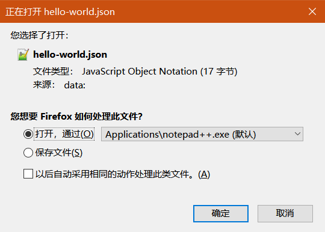

## 前言

介绍浏览器如何生成、下载与上传文件，以及js的文件流处理。

<!-- more -->

## 浏览器生成文件

**下载一个文件前，要先确定文件是从哪里生成的，一种是由浏览器生成，另一种是服务端生成文件。**生成文件之后，方可供用户下载到本地设备（计算机/移动设备）的存储空间。

我们先讨论浏览器的，再来讨论服务端。  

接下来我们会分别用几种方式生成同一个文件——文件名为`hello-world.json`，内容为`{"hello":"world"}`。

### new File

使用`js`的`File`对象可以创建一个文件 —— [new File](https://developer.mozilla.org/zh-CN/docs/Web/API/File/File)。

```javascript
const file = new File([JSON.stringify({ hello: "world" })], 'hello-world.json', { type: 'application/json' })
```


这是js文件对象最容易使用的一个`Web Api`了，接下来介绍的都是二进制文件对象，而且这几个对象互相都有继承关系，也可互相转换。

`application/json`——这是Content-Type（内容类型），常用于`HTTP`协议，用于定义网络文件的类型和网页的编码，决定浏览器将以什么形式、什么编码读取这个文件。

### Blob

[Blob](https://developer.mozilla.org/zh-CN/docs/Web/API/Blob)对象表示一个不可变、原始数据的类文件对象。它的数据可以按文本或二进制的格式进行读取。

```javascript
const blob = new Blob([JSON.stringify({ hello: "world" })], { type: 'application/json' })
```


直接打印显示的是一个`Blob`对象而且没办法直接查看文件的内容，我们可以用`Blob.text()`查看，该函数返回一个`Promise`对象。

```javascript
blob.text().then(x => console.log(x)) // {"hello":"world"}
```

### Data URLs

[Data URLs](https://developer.mozilla.org/zh-cn/docs/Web/HTTP/data_URIs)，即前缀为 data: 协议的URL，其允许内容创建者向文档中嵌入小文件。

```http
data:application/json,{"hello":"world"}
```

直接丢到浏览器的地址栏访问，即可。


Data URLs也可以表达用base64编码后的文件。

使用在线网站将“JSON转换Base64”，编码后可得`eyAiaGVsbG8iOiAid29ybGQiIH0=`，按照Data URL的格式组合。


```http
data:application/json;base64,eyAiaGVsbG8iOiAid29ybGQiIH0=
```

### 其他文件

到目前为止，我们分别用`new File` ，`Blob`，`Data Url`创建了一个`JSON`文件，那么如果要创建其他格式的文件呢。比如`*.txt`，`*.html`。上述的方法都有`application/json`的字符，也介绍过这是Content-Type，我们只需要更换相应的Content-Type类型即可，比如：用`html`的格式输出一级标题（`h1`），内容为`{"hello":"world"}`。

```http
data:text/html,<h1>{"hello":"world"}</h1>
```

更多文字格式可以自行搜索“Content-Type 手册”。

### 下载文件

现在来下载文件，通过浏览器生成的文件都可以通过使用`a`超链接标签下载，可能会疑惑为什么`a`标签可以下载文件，`H5`后，`a`标签多了一个`donwload`属性，此时浏览器会下载`href`指定的`url`表示的文件。

```html
<a href="data:application/json,{ &quot;hello&quot;: &quot;world&quot;}" download="hello-world.json">data URL</a>
```

*`HTML`中引号需要转义，即为`&quot;`*

点击之前先对浏览器进行两个设置，一个是设置**不自动保存文件**，一个是设置对`JSON`文件的处理方式。


确保设置生效后点击刚才的超链接，将会出现这个“打开文件”的弹窗提醒，可以选择**打开**也可以选择保存文件。

“打开”会直接通过指定的本地程序打开，此时目录保存在操作系统的缓存目录，比如我的是`C:\Users\Chris\AppData\Local\Temp\hello-world.json`。

“下载”会使其文件保存在本地存储设备，因为刚设置了“每次都问您要存在哪”，所以会让我们选择保存目录。



刚还只是`Data URL`方式创建的文件下载，要知道`new File`还有`Blob`并没有直接提供url。此时我们可以使用[URL.createObjectURL()](https://developer.mozilla.org/zh-CN/docs/Web/API/URL/createObjectURL)，直接将`new File`、`Blob`类型转换成一个`URL`。这次我们不用纯`HTML`实现，我们将通过交互动态创建一个`a`元素挂载到网页上。

```html
<button id="new-file">new File button</button>
```

```javascript
const newFileBtn = document.querySelector('#new-file')
newFileBtn.onclick = function () {
  // 创建文件
  const file = new File([JSON.stringify({ hello: "world" })], 'hello-world.json', { type: 'application/json' })
  console.log(file)

  // 下载文件
  const aLink = document.createElement('a')
  aLink.setAttribute('href', URL.createObjectURL(file))
  aLink.setAttribute('download', file.name)
  document.body.append(aLink)
  aLink.click()
  document.body.removeChild(aLink)
}
```

点击之后，跟上述的功能是一样的，只是“打开文件”的弹窗显示的“来源”将会是"Blob"，因为本身`new File`就是继承`Blob`实现的。写到这里，就顺便封装成一个函数吧。

```javascript
// 下载文件
function downloadFile(fileName, file) {
  const isBlob = file instanceof Blob
  const href = isBlob ? URL.createObjectURL(file) : file

  const aLink = document.createElement('a')
  aLink.setAttribute('href', href)
  aLink.setAttribute('download', fileName)
  document.body.append(aLink)
  aLink.click()
  document.body.removeChild(aLink)
}
```

## 服务端生成文件

...

## 结尾

...