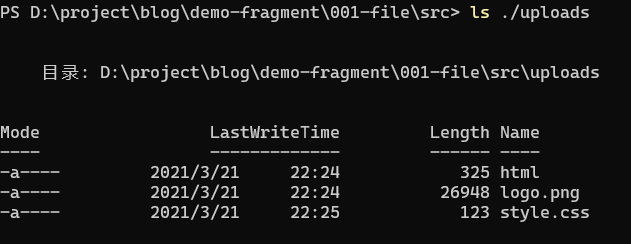

## 前言

浏览器/服务器如何生成、下载与上传文件，以及js的文件处理。

<!-- more -->

## 浏览器生成文件

**下载一个文件前，要先确定文件是从哪里生成的，一种是由浏览器生成，另一种是服务端生成文件。**生成文件之后，方可供用户下载到本地设备（计算机/移动设备）的存储空间。

实例代码：[001-file](https://github.com/Fifth-Patient/demo-fragment/tree/main/001-file)

我们先讨论浏览器的，再来讨论服务端。   

接下来我们会分别用几种方式生成同一个文件——文件名为`hello-world.json`，内容为`{"hello":"world"}`。

### new File

使用`js`的`File`对象可以创建一个文件 —— [new File](https://developer.mozilla.org/zh-CN/docs/Web/API/File/File)。

```javascript
const file = new File([JSON.stringify({ hello: "world" })], 'hello-world.json', { type: 'application/json' })
```


这是js文件对象最容易使用的一个`Web Api`了，接下来介绍的都是二进制文件对象，而且这几个对象互相都有继承关系，也可互相转换。

`application/json`——这是Content-Type（内容类型），常用于`HTTP`协议，用于定义网络文件的类型和网页的编码，决定浏览器将以什么形式、什么编码读取这个文件。

### Blob

[Blob](https://developer.mozilla.org/zh-CN/docs/Web/API/Blob)对象表示一个不可变、原始数据的类文件对象。它的数据可以按文本或二进制的格式进行读取。

```javascript
const blob = new Blob([JSON.stringify({ hello: "world" })], { type: 'application/json' })
```


直接打印显示的是一个`Blob`对象而且没办法直接查看文件的内容，我们可以用`Blob.text()`查看，该函数返回一个`Promise`对象。

```javascript
blob.text().then(x => console.log(x)) // {"hello":"world"}
```

### Data URLs

[Data URLs](https://developer.mozilla.org/zh-cn/docs/Web/HTTP/data_URIs)，即前缀为 data: 协议的URL，其允许内容创建者向文档中嵌入小文件。

```http
data:application/json,{"hello":"world"}
```

直接丢到浏览器的地址栏访问，即可。


Data URLs也可以表达用base64编码后的文件。

使用在线网站将“JSON转换Base64”，编码后可得`eyAiaGVsbG8iOiAid29ybGQiIH0=`，按照Data URL的格式组合。


```http
data:application/json;base64,eyAiaGVsbG8iOiAid29ybGQiIH0=
```

### 其他文件

到目前为止，我们分别用`new File` ，`Blob`，`Data Url`创建了一个`JSON`文件，那么如果要创建其他格式的文件呢。比如`*.txt`，`*.html`。上述的方法都有`application/json`的字符，也介绍过这是Content-Type，我们只需要更换相应的Content-Type类型即可，比如：用`html`的格式输出一级标题（`h1`），内容为`{"hello":"world"}`。

```http
data:text/html,<h1>{"hello":"world"}</h1>
```

更多文字格式可以自行搜索“Content-Type 手册”。

### 下载文件

现在来下载文件，通过浏览器生成的文件都可以通过使用`a`超链接标签下载，可能会疑惑为什么`a`标签可以下载文件，`H5`后，`a`标签多了一个`donwload`属性，此时浏览器会下载`href`指定的`url`表示的文件。

```html
<a href="data:application/json,{ &quot;hello&quot;: &quot;world&quot;}" download="hello-world.json">data URL</a>
```

*`HTML`中引号需要转义，即为`&quot;`*

点击之前先对浏览器进行两个设置，一个是设置**不自动保存文件**，一个是设置对`JSON`文件的处理方式。


确保设置生效后点击刚才的超链接，将会出现这个“打开文件”的弹窗提醒，可以选择**打开**也可以选择保存文件。

“打开”会直接通过指定的本地程序打开，此时目录保存在操作系统的缓存目录，比如我的是`C:\Users\Chris\AppData\Local\Temp\hello-world.json`。

“下载”会使其文件保存在本地存储设备，因为刚设置了“每次都问您要存在哪”，所以会让我们选择保存目录。


刚还只是`Data URL`方式创建的文件下载，要知道`new File`还有`Blob`并没有直接提供url。此时我们可以使用[URL.createObjectURL()](https://developer.mozilla.org/zh-CN/docs/Web/API/URL/createObjectURL)，直接将`new File`、`Blob`类型转换成一个`URL`。这次我们不用纯`HTML`实现，我们将通过交互动态创建一个`a`元素挂载到网页上。

```html
<button id="new-file">new File button</button>
```

```javascript
const newFileBtn = document.querySelector('#new-file')
newFileBtn.onclick = function () {
  // 创建文件
  const file = new File([JSON.stringify({ hello: "world" })], 'hello-world.json', { type: 'application/json' })
  console.log(file)

  // 下载文件
  const aLink = document.createElement('a')
  aLink.setAttribute('href', URL.createObjectURL(file))
  aLink.setAttribute('download', file.name)
  document.body.append(aLink)
  aLink.click()
  document.body.removeChild(aLink)
}
```

点击之后，跟上述的功能是一样的，只是“打开文件”的弹窗显示的“来源”将会是"Blob"，因为本身`new File`就是继承`Blob`实现的。写到这里，就顺便封装成一个函数吧。

```javascript
// 下载文件
function downloadFile(fileName, file) {
  const isBlob = file instanceof Blob
  const href = isBlob ? URL.createObjectURL(file) : file

  const aLink = document.createElement('a')
  aLink.setAttribute('href', href)
  aLink.setAttribute('download', fileName)
  document.body.append(aLink)
  aLink.click()
  document.body.removeChild(aLink)
}
```

## 服务端生成文件

这一章开始会涉及到服务端，将使用`express`——一个`node`的`web`框架搭建一个`api`服务，拥有**文件上传与下载**的功能，具体实现不会讲得太详细，因为我们的重心还在放在浏览器。

我们先设计一个上传文件的api——`POST`方法，使用`form-data`传递参数，这个接口接收文件后保存在服务器。

### 上传文件


api 文档
```
POT localhot:3000/api/file/upload 文件上传
form-data - { file: <文件> }
```

接口实现
```javascript
// ... 省略部分express代码

// 配置上传功能
const multer = require('multer')
const uploadPath = path.join(__dirname, './uploads/') // 上传目录
const upload = multer({
  dest: uploadPath,
  storage: multer.diskStorage({
    destination: function (req, file, cb) {
      cb(null, uploadPath)
    },
    filename: function (req, file, cb) {
      cb(null, file.originalname)
    }
  })
})

//初始化 uploadPath
fs.exists(uploadPath, exists => {
  if (!exists) {
    fs.mkdir(uploadPath, e => {
      e && console.error(e)
    })
  }
})


// 上传文件
app.post('/api/file/upload', upload.fields([{ name: 'file', maxCount: 1 }]), (req, res) => {
  res.json({
    code: 1,
    msg: 'success',
    data: null
  })
})

app.listen(port, () => console.log(`Example app listening on port ${port}!`))
```

前端上传实现
```html
    <form action="/api/file/upload" method="POST" enctype="multipart/form-data">
      <input type="file" name="file" />
      <button type="submit">上传</button>
    </form>
```

这里提供三个文件，作为测试文件依次上传：
1. [html](/download/file/html) (事实上这个一个html文件，只是文件名为`html`而已)
2. [logo.png](/download/file/logo.png)
2. [style.css](/download/file/style.css)



`ls`查看上传目录有相应的文件且`Length`大于0，则表示以上代码能正常运行功能。

### 下载文件

由服务端生成的文件，`api`可能响应以下三种类型的数据：

1. 直接响应文件，供浏览器直接下载
2. 响应文件内容，由浏览器生成匹配的文件格式后方可下载
3. 响应文件路径，由浏览器自行处理（参考1，2）

直接响应文件，浏览器可以使用`window.open()` 或者 `<a downlaod href=""></a>`直接下载。响应内容稍微比较麻烦，如果是直接响应文件内容（不是base64），浏览器需要转成base64（存在不知道其文件格式转换失败的场景），如果是直接响应base64字符串则可以用`URL.createObjectURL`处理。响应文件路径一般浏览器直接打开此路径即可下载。

我们还是先设计一个`api`，让其拥有下载功能，这个api应该接收两个参数，一个是指定的文件，另一个是指定响应的数据类型

```
GET /api/file/download
query fileName [String] 文件名称
query type     [String] 数据类型 content - 文件内容、base64-base64、path-文件路径、file-返回文件
```

```javascript
// 下载文件
app.get('/api/file/download', (req, res) => {
  const { type, fileName } = req.query

  // 是否缺失必填参数
  if (!type) {
    return res.status(200).json({
      code: -1,
      msg: 'query type is must need!'
    })
  } else if (!fileName) {
    return res.status(200).json({
      code: -1,
      msg: 'fileName type is must need!'
    })
  }

  if (type === 'file') { // 返回文件
    let fileURL = path.join(uploadPath, fileName)
    res.download(fileURL)
  } else if (type === 'content') { // 返回文件内容
    let fileURL = path.join(uploadPath, fileName)
    let fileData = fs.readFileSync(fileURL)
    let bufferData = Buffer.from(fileData).toString()
    res.json({
      code: 1,
      msg: 'success',
      data: bufferData
    })
  } else if (type === 'base64') { // 返回base64
    let fileURL = path.join(uploadPath, fileName)
    let fileData = fs.readFileSync(fileURL)
    let bufferData = Buffer.from(fileData).toString('base64')
    let base64 = 'data:' + mineType.lookup(fileURL) + ';base64,' + bufferData.toString('base64')
    res.json({
      code: 1,
      msg: 'success',
      data: base64
    })
  } else if (type === 'path') { // 返回路径
    res.json({
      code: 1,
      msg: 'success',
      data: `/api/uploads/${fileName}`
    })
  }
})


```

```html
<p>
  <input id="file-name" name="fileName" />
  <select id="download-type">
    <option value="file">file</option>
    <option value="content">content</option>
    <option value="base64">base64</option>
    <option value="path">path</option>
  </select>
  <button id="download-api-btn">下载</button>
</p>
```

```javascript
  const downloadApiBtn = document.querySelector('#download-api-btn')
  downloadApiBtn.onclick = function () {
    const fileName = document.querySelector('#file-name').value
    const type = document.querySelector('#download-type').value

    fetch(`/api/file/download?fileName=${fileName}&type=${type}`)
      .then(async response => {
        if (type === 'file') {
          let blob = await response.blob()
          downloadFile(fileName, blob)
          // 也可以使用window.open
          // window.open(`/api/file/download?fileName=${fileName}&type=${type}`, '_blank')
          return
        }

        let json = await response.json()

        if (json && json.code === 1) {
          const data = json.data
          if (type === 'content') {
            const blob = new Blob([data.toString()])
            downloadFile(fileName, blob)
          } else if (type === 'base64') {
            downloadFile(fileName, data)
          } else if (type === 'path') {
            window.open(data, '_blank')
          }
        }
      })
  }
```

其实当这里type为file的时候直接返回文件，是可以不需要发起http请求，直接`window.open()`就可以的，这里只是为了演示，实际开发中建议返回文件直接`window.open()` 或者 `<a downlaod href=""></a>`。

其次`/api/file/download?fileName=logo.png&type=content` 可以下载图片，不过无法打开。为什么呢，首先这是一张图片，`type=content`只是返回了图片文件的内容，浏览器接收到了文件的内容，可是并不知道用什么格式去解析，所以这里导致图片下载下来了，然后并不能预览。所以**服务器返回文件内容需要双端约定好文件格式**。然而就算如此，浏览器也需要将起转成`Blob`或者是其他文件对象再下载下来。

相对于`base64`字符串，也是要使用`URL.createObjectURL`将其转成`Data URLs`，相对来讲`base64`浏览器就无需关注文件格式了。

最方便处理的莫过于直接响应文件了。

## 结尾

这次我们主要介绍了浏览器和服务器的生成、下载、上传文件，还介绍了浏览器中的`<a download="fileName" href="content">`，以及 `new File`，`Blob`和`Data URLs`三种方式表达一个文件。前此文还有未提及的`Array Buffer`、[XMLHttpRequest.responseType](https://developer.mozilla.org/zh-CN/docs/Web/API/XMLHttpRequest/responseType)需要我们后续自行了解。